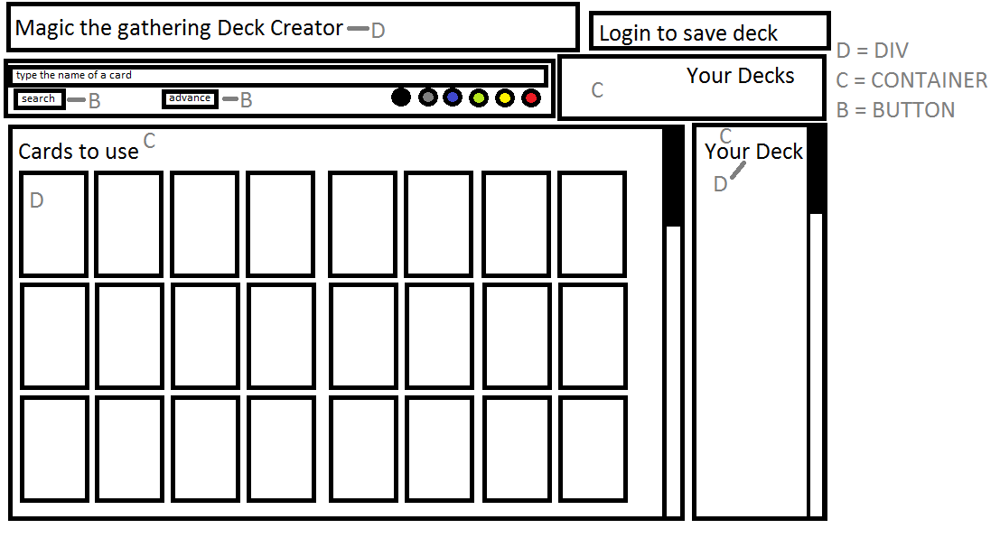

- [Project Name](#project-name)
- [Group Members](#group-members)
- [Project Description](#project-description)
- [MVP features](#mvp-features)
- [Stretch goals](#stretch-goals)
- [UI Concept](#ui-concept)
- [Tech to use](#tech-to-use)

## Project Name
**Tome of Legends**
## Group Members
Kira Mueller, Dathan Bauman, Jason Richard, Richard Zhou
## Project Description
Deck building app for the trading card game, *Magic: The Gathering*. 
## MVP features
- Search cards by various parameters
- Create/delete decks
- Add/remove cards to/from a deck list
- Ability to store deck lists with user login
- Share decks via URL
## Stretch goals
- Deck analytics
- Suggest other users' decks to view
- View tournament winning decks
- Download formatted text deck list
- Tutorial videos
## UI Concept

## Tech to use
- "mtg-json" npm package
- User authentication (specific implementation TBD)
- Scryfall card image [API](https://scryfall.com/docs/api/images)